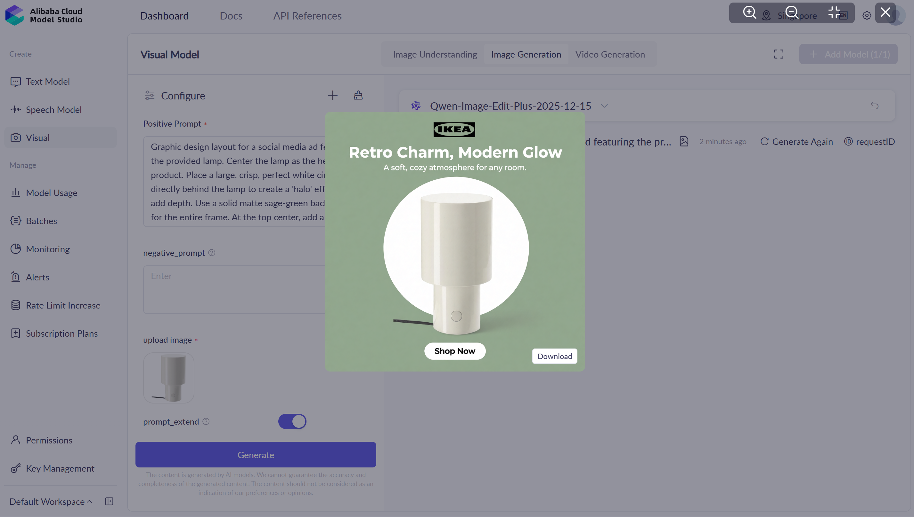
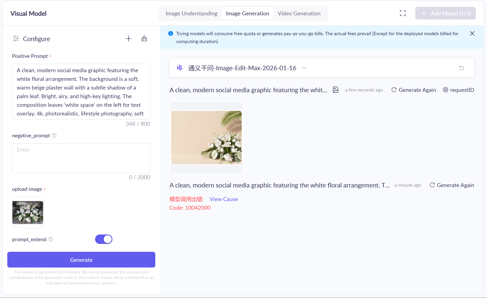

# Addreams MVP

> AI-powered ad creative generation. Clone of [adcreative.ai](https://www.adcreative.ai/) — focused on image and video ad production powered by Qwen models.

No auth or profiles in this phase. Just the landing page, core workflows, and API integration.

---

## Core Features

### 1. Ad Graphics
Generate ready-to-post social media ad creatives from a product reference image + text prompt. The model composes the product into a styled graphic with copy, branding, and layout.

**Reference + prompt → styled ad graphic:**

### 2. Product Shoots
Generate product photography — either from a reference image or purely from a text description. Photorealistic shots, lifestyle scenes, commercial food photography, etc.

**Text-only → product image (no reference needed):**

**Reference + prompt → styled product image:**

### 3. Video Shoots
Generate product videos from a reference image/video + text prompt. Product demos, social clips, brand videos.

*(No demo screenshots yet — same Qwen/Wan model family supports this.)*

---

## User Workflows

Two customer profiles drive the UX:

| Profile | Behavior | UX Strategy |
|---------|----------|-------------|
| **Clear vision** | Has a specific idea, brings reference images, knows the framing they want | Steer toward detailed prompting; minimal hand-holding |
| **Needs inspiration** | Wants ideas, exploring aesthetics | Offer variety — template galleries, style presets, batch mock-ups to kickstart creativity |

---

## Models (Qwen / Alibaba Cloud)

| Capability | Models |
|------------|--------|
| Image generation | Qwen-Image-Max, Z-Image-Turbo, Wan - Text to Image |
| Image editing | Qwen-Image-Edit-Max, Qwen-Image-Edit-Plus, Wan - Image Edit |
| Video generation | Wan - Image to Video, Wan - Text to Video, Wan - Reference to Video |

---

## API Endpoints (Stubs)

Per [setup-plan.md](../setup-plan.md):

- `POST /api/workflows/image-from-text` — text-only image generation
- `POST /api/workflows/image-from-reference` — reference image + prompt
- `POST /api/workflows/video-from-reference` — reference image/video + prompt
- `GET /api/health` — service health check

---

## Competitive Reference

[adcreative.ai](https://www.adcreative.ai/) feature mapping:

| adcreative.ai | Addreams MVP | Later |
|---------------|-------------|-------|
| Ad Creatives | Ad Graphics | |
| Product Photoshoots | Product Shoots | |
| Product Videoshoots | Video Shoots | |
| Text & Headlines | | Copywriting |
| Creative Scoring | | Performance prediction |
| Competitor Insights | | Analytics |
| Compliance Checker | | Brand safety |
| Custom Templates | | Template system |
| Bulk Generation | | Batch workflows |
